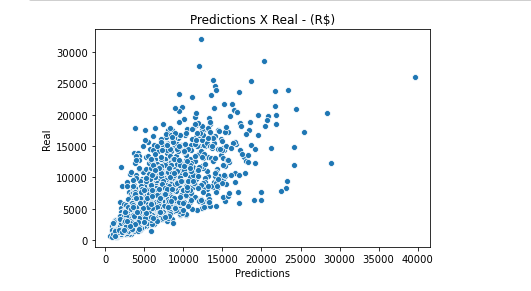

# [House_prices_Brazil]
Regression Problem to solve.
The dataset font is here: (https://www.kaggle.com/rubenssjr/brasilian-houses-to-rent)
for this project we are gonna use the Version2 of the dataset.

The code and its step by step was written in portuguese so i will organize this file in steps that were done in the code.

1- After verifying the integrity of the data and confirming that there is no missing or wrong data we can start the regression model, but first things first we need to see all the data and look for the categorical columns to transform in a numerical, and after look for outliers and in this dataset there was many outliers, we gonna JUST delete the non-sense outliners like a apartment on the 301º floor and similar stuffs

2-In order to make a regression model for these data we have to separate the values and transform them into a single scale for the model to work, we are using the sklearn library so we are using besides the log transformation to all features stay close, the StandardScaler to all features stay in a close scaler than the value we are loking for in this case the total value of houses. 

3-I used two types of different models one its the DecisionTreeRegressor and the other one its the LinearRegression.

4- The Linear regression had the best result the R_2 score was: 0.7471825575553804

